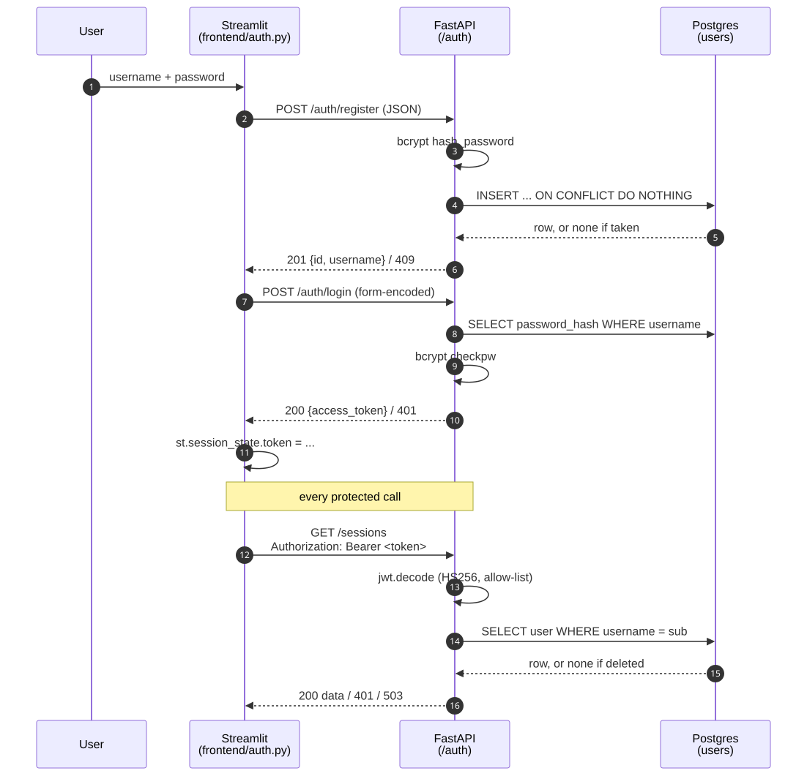

# Auth Flow

Username/password sign-in issuing a **stateless JWT bearer token**. Every
endpoint that touches user data (`/chat`, `/sessions/*`) requires one; `/health`
does not.




## Where the pieces live

| File | Responsibility |
|------|----------------|
| `app/auth/security.py` | bcrypt hash/verify, JWT encode/decode. Pure functions — no database, no FastAPI |
| `app/api/routes/auth.py` | `POST /auth/register`, `POST /auth/login`. |
| `app/api/deps.py` | `get_current_user` — the dependency every protected route depends on. |
| `app/data_access/users.py` | The `users` table: `get_user`, `create_user`, `delete_user`, `ensure_table`. |
| `app/schemas/auth.py` | `Credentials` (input), `Token`, `User` |
| `frontend/auth.py` | Streamlit sign-in gate; holds the token in `st.session_state`. |
| `frontend/api_client.py` | Attaches `Authorization: Bearer …`; maps 401 to `AuthError`. |

## Register — `POST /auth/register`

JSON body, validated by `Credentials` before any code runs:

```
username  3-32 chars, ^[A-Za-z0-9_.-]+$
password  8-32 chars
```

The password is hashed with **bcrypt** (`bcrypt.gensalt()` — a per-user salt,
embedded in the stored hash) and inserted with
`ON CONFLICT (username) DO NOTHING RETURNING id, username`. No row back means
the name is taken → **409**. Doing it in one statement rather than
`SELECT`-then-`INSERT` means two simultaneous registrations of the same name
cannot both win the check.

The response model is `User` (`id`, `username`) — deliberately without a
`password_hash` field, so a hash cannot leak through a response by accident.


| Status | Meaning |
|--------|---------|
| 201 | Created, returns `{id, username}` |
| 409 | Username taken |
| 422 | Failed the length/charset rules |

## Login — `POST /auth/login`

**Form-encoded, not JSON** — two plain `Form()` fields. That is what FastAPI's
own `/docs` "Authorize" button , so
a reviewer can sign in from Swagger without hand-building a request. It is the
one endpoint whose body shape differs from the rest of the API.

On success: `Token(access_token=…, token_type="bearer")`.

**Both failure modes return the identical 401 and message** — "Incorrect
username or password." A distinct "no such user" would let anyone enumerate
which usernames exist. bcrypt's verify runs only when a row was found, so the
timing does differ slightly; closing that would mean verifying against a dummy
hash on the miss path, which is a deliberate omission at this scale.

A database failure during lookup is a **503**, not a 401 — telling users their
credentials are wrong when the truth is that Postgres is down is a false
statement about their account.

## The token

`create_access_token` signs three claims with **HS256**:

| Claim | Value |
|-------|-------|
| `sub` | username |
| `iat` | issued at (UTC) |
| `exp` | `iat + ACCESS_TOKEN_EXPIRE_MINUTES` (default **60**) |

Nothing else. No `user_id`, no roles — anything authorization depends on is read
from the database per request instead, so a stale token cannot carry stale
facts.

`JWT_SECRET` has no default and the app **refuses to start without it**
(`main.lifespan` raises with the generator command). A signing key that falls
back to a placeholder is a key that ships to production.

```bash
python -c "import secrets; print(secrets.token_urlsafe(32))"
```

`username_from_token` decodes with `algorithms=[settings.jwt_algorithm]` — an
allow-list. Without it a token could name its own algorithm, including `none`,
and forge itself. Any `PyJWTError` (expired, tampered, wrong key) and a missing
`sub` both become `InvalidToken`.

## Authenticating a request — `get_current_user`

Protected routes declare `user: Annotated[User, Depends(get_current_user)]`.
The dependency:

1. Reads the `Authorization: Bearer …` header via `HTTPBearer(auto_error=False)`
   — `auto_error=False` so a missing header produces *this* module's 401 rather
   than FastAPI's default, keeping one message for every auth failure.
2. Decodes the token → username, or **401**.
3. **Re-reads the user row every request** rather than trusting the token's
   claims. An account deleted after the token was issued gets **401**, not
   service.
4. A database failure here is **503**, for the same reason as in login.

Every 401 carries `WWW-Authenticate: Bearer`, which is what makes it a
spec-correct 401 rather than a bare one.

## Authorization — owning your own data

Authentication produces a `User`; **ownership is enforced separately**, at the
data-access layer. Every read and write in `app/data_access/chat_history.py`
takes `user_id` and filters on it:

```sql
select ... from chat_sessions where id = %s and user_id = %s
```

So a valid token for user A asking for user B's session gets **404**, not 403 —
the row simply is not in that user's result set, and the response does not
confirm the session exists. `chat_sessions.user_id` is
`references users(id) on delete cascade`, so deleting a user takes their
sessions and messages with them.

`get_messages(session_id)` is the one function that does *not* take a
`user_id` — it is only ever reached after the caller has already passed
`get_session(session_id, user_id)`, which is where the check lives.

## Frontend

`frontend/auth.py:require_login()` returns the token or renders the sign-in gate
and calls `st.stop()`. The `st.stop()` is what keeps it honest: nothing below
the call site runs until a token exists, so no page can forget to check.

The token lives in `st.session_state` — per browser session, held in the
Streamlit server process. **A page refresh signs the user out.** A cookie would
survive it, but Streamlit has no first-class cookie API and a third-party
component was not worth it here.

`api_client` keeps `AuthError` separate from `BackendError` precisely so the UI
can tell "sign in again" from "the service is broken". Registration signs the
user straight in rather than making them retype what they just typed.

### Expiry mid-conversation

A 60-minute token can expire between page loads. `api_client.ask` maps the
resulting 401 to `AuthError`; `frontend/app.py` drops the stored token, so the
next rerun falls back through `require_login()` to the sign-in form.

### Sign-out and revocation

`sign_out()` is **client-side only** — it clears `token`, `username`, messages
and `session_id` from session state. The token itself stays valid until `exp`.
Revoking server-side would mean a token blacklist, which needs a store this
project does not have. The mitigation is the short expiry.

## Configuration

| Variable | Default | Notes |
|----------|---------|-------|
| `JWT_SECRET` | *(none)* | **Required.** App refuses to start without it. |
| `JWT_ALGORITHM` | `HS256` | Also the decode allow-list. |
| `ACCESS_TOKEN_EXPIRE_MINUTES` | `60` | |


## Tests

`tests/test_auth.py` — hashing and token round-trips run offline; the endpoint
tests use `TestClient` against the real Postgres, like the rest of the suite.

Rejection is tested per failure mode rather than in bulk: expired token,
token signed with another secret, tampered payload, token with no `sub`,
garbage token, and no token at all. Plus: `/health` stays public, the duplicate
username is a 409, the password length boundary is 422 at 33 characters, and
unknown-user and wrong-password responses are asserted **identical**.

`test_a_multibyte_password_under_the_character_limit_still_crashes_hashing`
documents the byte-limit gap below as a known gap rather than silently fixing
it.
