# Database — ER Diagram

Four tables in the same Postgres instance, in two unrelated groups:

- **`financial_data`** — the provided fixture, loaded from `data/financial_data.sql`.
  Standalone; nothing else references it.
- **`users` → `chat_sessions` → `chat_messages`** — created by the app itself
  (`app/data_access/users.py`, `app/data_access/chat_history.py`), no dump or
  migration tool. `POST /auth/register` and `POST /chat` call `ensure_table(s)()`
  (`CREATE TABLE IF NOT EXISTS`) lazily on first use.



## `financial_data`

Column notes: `year` is fiscal year 2022-2025; `revenue`/`net_income`/
`operating_income`/`gross_profit` are USD; `net_income` may be negative;
**every monetary column is nullable** (see NULL counts below).

- **Rows:** 192 (~48 companies x 4 years, 2022-2025)
- **Grain:** one row per `(company, year)` — the natural key, though not
  declared as a constraint in the dump.
- **Units:** all monetary columns are raw USD `BIGINT` (e.g. `394328000000`).

### Observations / caveats

- **No primary key, unique, or foreign-key constraints.** The intended
  uniqueness is `(ticker, year)`. Add it when hardening the schema:
  ```sql
  ALTER TABLE financial_data ADD CONSTRAINT pk_financial_data
      PRIMARY KEY (ticker, year);
  ```
- **Denormalized on purpose.** `sector` repeats for every row of a company
  rather than living in a separate `companies` table. Acceptable for a small,
  read-only analytics workload; no need to normalize.
- **NULLs (`\N` in the dump) are widespread — including `revenue` itself.**
  Measured over all 192 rows:

  | Column | NULLs / 192 |
  |--------|:-----------:|
  | `gross_profit`     | 134 |
  | `operating_income` | 76  |
  | `revenue`          | 13  |
  | `net_income`       | 4   |

  Mostly the Finance sector, whose income statements don't map onto these
  lines. **`revenue` is NULL for all years of Goldman, Morgan Stanley, USB,
  and WellsFargo** — so a revenue-growth question touching those companies
  cannot be answered and must be refused, not guessed. Answers must always
  distinguish "value not available" from "value is zero/negative".
- **`net_income` can be negative** (e.g. AbbVie 2024 = -22M, Amazon 2022).
  Growth-rate math must handle negative and zero denominators.
- **Fiscal year is taken as-labeled.** Companies have different fiscal-year
  ends (Apple ends late September; Alphabet/Meta/Amazon end December). We do
  not reconcile calendar periods — `year` is used exactly as stored.

### Coverage vs. the vector store

The SQL table covers ~48 companies. The vector store (10-K text) covers only
**Alphabet, Amazon, Apple, Meta**. A company can therefore have financial
numbers but no filing text to ground a qualitative "why" answer — e.g.
Microsoft has SQL figures but no 10-K.

## `users`

One row per account. `password_hash` is a bcrypt hash — never the plaintext
password, never returned by any API response (see `app/schemas/auth.py`'s
`User` model, which has no `password_hash` field at all, so a hash can't leak
through a response by field-naming accident).

## `chat_sessions`

One row per conversation. `id` is a Python-generated `uuid4`, stored as plain
`text` rather than Postgres's native `uuid` type — one fewer type to think
about, nothing here needs the database to validate or generate it.

- `title` is derived once, from the first question (truncated to 60 chars) —
  there's no rename endpoint.
- `updated_at` is bumped on every new message in the session, which is what
  the sidebar's "most recent first" ordering sorts on.
- `ON DELETE CASCADE` from `users`: deleting a user drops all their sessions
  (and, transitively, their messages) automatically.

## `chat_messages`

One row per turn, `role` constrained to `'user'` or `'assistant'`. The
grounding columns (`route`, `grounded`, `missing_reason`, `companies`,
`citations`) are only ever populated for `role = 'assistant'` — a user
message has nothing to ground, so they stay `NULL`.

- `companies` / `citations` are `jsonb` — a list of strings and a list of
  `{company, page}` objects respectively, matching `ChatResponse`'s shape
  one-for-one so the API can return a stored row without reshaping it.
- `ON DELETE CASCADE` from `chat_sessions`: deleting a session drops its
  messages with it — confirmed in `tests/test_chat_history.py`.
- Every read is scoped through `chat_sessions.user_id` first (never queried
  by `session_id` alone) — a session belongs to exactly the user who started
  it, and that ownership check is what a `GET /sessions/{id}/messages` from a
  different user 404s against.
