# Agent Design — LangGraph

The chatbot is a thin LangGraph state machine, not an autonomous ReAct agent.
Control flow is explicit so the **no-hallucination** requirement is enforced by
the graph rather than left to the model's discretion.

## Graph flow

## Nodes

| Node | Responsibility |
|------|----------------|
| `classify` | Extract the companies mentioned (with alias resolution: Facebook→Meta, Google→Alphabet) and choose a route: `sql`, `vector`, `hybrid`, or `unsupported`. Heuristic today; swappable for an LLM classifier. |
| `fetch_data` | Call `query_financials` (Postgres) and/or `search_filings` (Pinecone, filtered per company via `metadata.title`) based on the route. |
| `check_grounding` | **The no-hallucination gate.** Only route to `synthesize` if grounding data actually came back. Otherwise route to `refuse`. Records a `missing_reason`. |
| `synthesize` | LLM composes the answer using retrieved SQL rows + filing chunks as the *only* allowed context. If `missing_reason` is set (partial coverage), the answer must say so explicitly. |
| `refuse` | Returns a clear "cannot answer with available data" message naming what's missing — no invented figures. |

## Routing per baseline question

| Question | Route | Sources | Notes |
|----------|-------|---------|-------|
| **Q1** Apple net income 2022-2025 | `sql` | Postgres only | Pure structured lookup. |
| **Q2** Google vs Facebook revenue structure & strategy 2025 | `hybrid` | Postgres + vector | Two *separate* per-company filtered vector queries (Alphabet, Meta) so results don't mix. |
| **Q3** Highest revenue growth among MSFT/AAPL/GOOG/FB + why | `hybrid` | Postgres + vector | Growth from SQL; "why" from 10-Ks — **but Microsoft has no filing**, so `check_grounding` sets a `missing_reason` and the answer must flag that the "why" is unavailable for Microsoft. |

## Why this shape

- **Grounding is a control-flow property**, so it's an explicit node/edge we own
  — not a hope that a tool-calling loop decides correctly.
- The **data-access seam** (`tools.py`) is isolated from graph wiring, so the
  live-session extensions (new sources, new routes) plug in without rewrites.
- **LangSmith tracing** wraps the whole graph via env vars, giving a visible
  audit trail from question → routing → retrieval → grounded answer.

## State

`GraphState` (see `app/agent/state.py`) carries: `question`, `companies`,
`route`, `sql_results`, `vector_results`, `grounded`, `missing_reason`,
`answer`.
